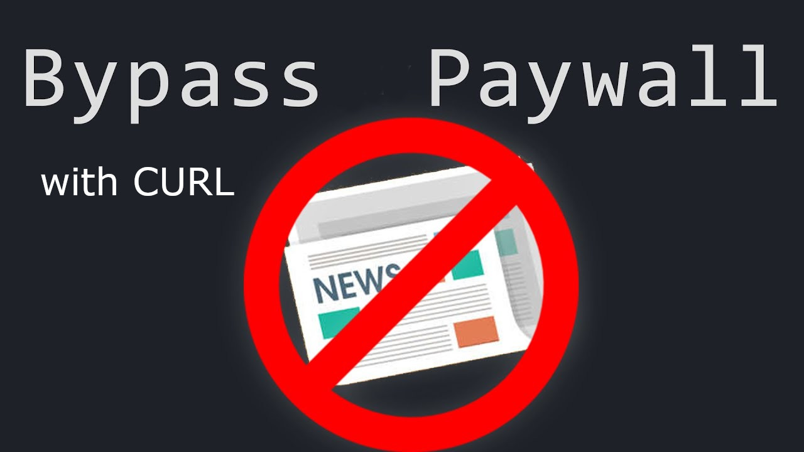

# bypasspaywall

Bypass paywalls with CURL to get a downloaded version of the fullpage content. The script will prompted for the URL and also the filename of the HTML file it will place in the same location, so that you may open it with your webbrowser to read.

Run the script in linux with the following command:

./getPageBody

